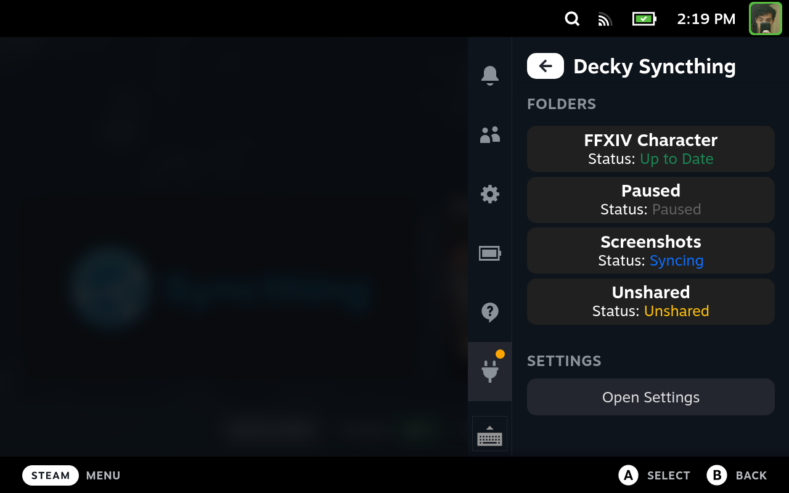
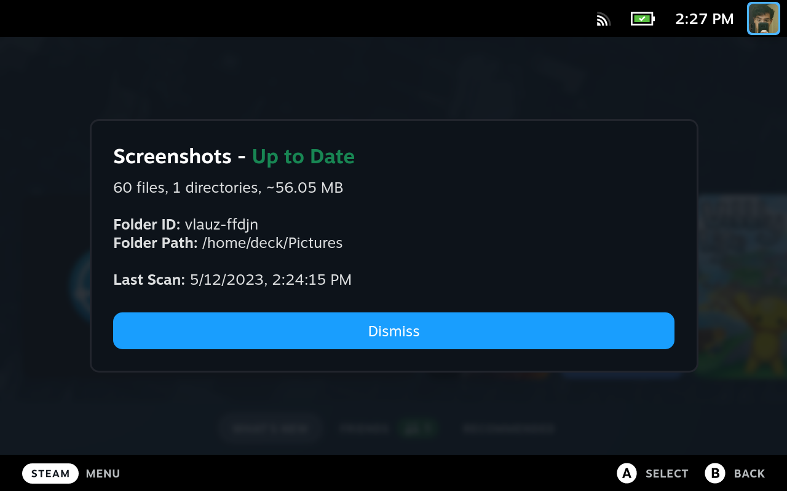
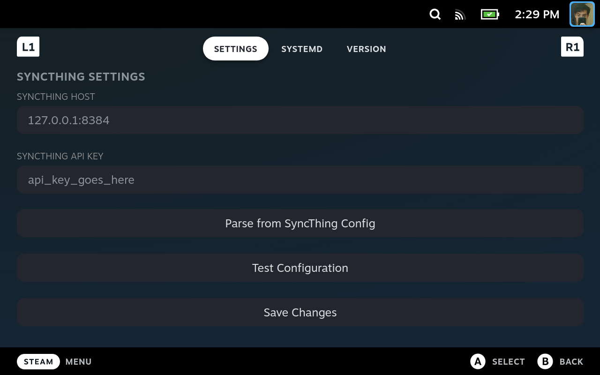

 

# Decky Syncthing

A SyncThing Frontend for Decky Loader!

## Screenshots

  
Click to expand

  
  
  

## Development

In order to set up a development environment, you'll need to do the following:

- Prerequisites
  - Make sure your Steam Deck has SSH enabled
  - Make sure you have a recent version of Node installed
  - You'll also need pnpm installed, `sudo npm i -g pnpm`
- Clone the repo to your machine
- Run `make init` to install dependencies and generate a .env file
- Edit the .env file to suit your environment
- Run `make build-front deploy`